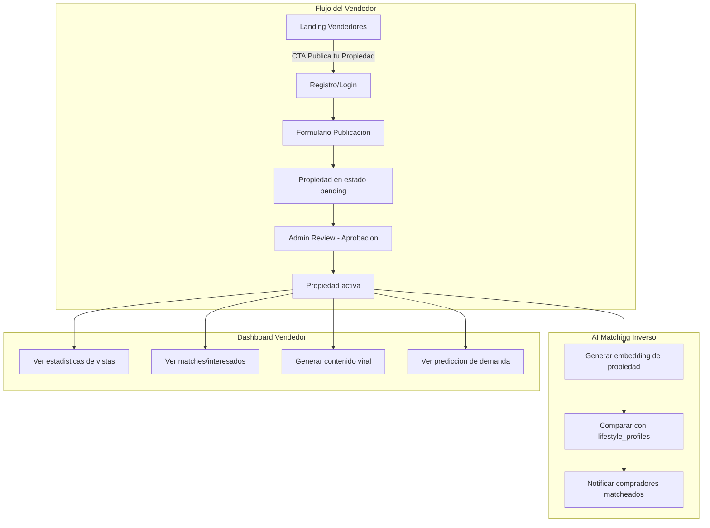

# Publicar Propiedades en Smarlin - "Vende Mas Rapido con el Comprador Ideal"

## Contexto

Actualmente Smarlin es 100% buyer-focused: las propiedades vienen de MLS/IDX (Showcase IDX, Xposure, Zillow Bridge) y los usuarios solo pueden buscar y guardar propiedades. No existe ningun flujo para que propietarios/vendedores listen sus propiedades.

**Requerimientos (Kelvin - Feb 6, 2026):**

- Que la gente pueda traer sus propiedades directamente
- Una forma de publicarlas
- Justificar por que deben estar en la plataforma (campana)
- Vender inteligentemente, matchear con el comprador ideal

## Arquitectura Propuesta

## Tareas de Implementacion

| #   | Tarea                                          | Fase         | Estado    |
| --- | ---------------------------------------------- | ------------ | --------- |
| 1   | Migracion SQL `016_seller_listings.sql`        | MVP          | Pendiente |
| 2   | Actualizar tipos TypeScript (`database.ts`)    | MVP          | Pendiente |
| 3   | API endpoints seller properties (CRUD)         | MVP          | Pendiente |
| 4   | Formulario de publicacion multi-step           | MVP          | Pendiente |
| 5   | Landing de vendedores (`/vender`)              | MVP          | Pendiente |
| 6   | Dashboard del vendedor                         | Gestion      | Pendiente |
| 7   | Admin: aprobacion de propiedades               | Gestion      | Pendiente |
| 8   | Storage de imagenes (Supabase Storage)         | Gestion      | Pendiente |
| 9   | Middleware: proteccion de rutas                | Gestion      | Pendiente |
| 10  | AI matching inverso (propiedad -> compradores) | Inteligencia | Pendiente |
| 11  | Sistema de inquiries (consultas)               | Inteligencia | Pendiente |
| 12  | Actualizar landing principal                   | Inteligencia | Pendiente |
| 13  | Integracion con contenido viral existente      | Inteligencia | Pendiente |

---

## Cambios Detallados

### 1. Migracion de Base de Datos

Crear `supabase/migrations/016_seller_listings.sql` con:

- **Nuevas columnas en `properties`:**

  - `owner_id` (UUID, FK a users, nullable) - quien publico la propiedad
  - `submission_status` ('draft' | 'pending_review' | 'approved' | 'rejected')
  - `rejection_reason` (text, nullable)
  - `is_user_submitted` (boolean, default false) - distinguir de propiedades IDX
  - `views_count` (integer, default 0)
  - `inquiries_count` (integer, default 0)

- **Nueva tabla `property_inquiries`:**

  - `id`, `property_id` (FK), `user_id` (FK), `message`, `phone`, `email`
  - `status` ('new' | 'read' | 'responded')
  - `created_at`

- **RLS policies:**
  - Propietarios pueden CRUD sus propias propiedades
  - Solo propiedades `approved` son visibles publicamente (junto con las IDX)
  - Propietarios ven inquiries de sus propiedades

### 2. Nuevo Rol de Usuario: "seller"

Actualizar `role` en la tabla `users` para incluir 'seller' (ademas de 'user', 'admin', 'agent').

**Archivo:** `src/types/database.ts`

- Agregar 'seller' al tipo de role
- Agregar tipo `PropertyInquiry`
- Agregar campos nuevos al tipo `Property`

### 3. Pagina de Landing para Vendedores

Crear `src/app/vender/page.tsx` - Landing page especifica para vendedores.

**Propuesta de valor (la campana):**

- **"Vende + Rapido"** - Nuestra IA encuentra compradores que ya buscan exactamente lo que ofreces
- **"Comprador Ideal"** - Matching inteligente basado en estilo de vida, no solo filtros
- **"Precio Inteligente"** - Analisis de demanda y prediccion de equity te dice el precio optimo
- **"Marketing Viral"** - Generamos contenido optimizado para redes sociales de tu propiedad
- **"Sin Comisiones de Agente"** - Publica directo, sin intermediarios

**Estructura de la pagina:**

- Hero: "Tu propiedad merece el comprador perfecto" con CTA
- Stats: propiedades vendidas, tiempo promedio de venta, compradores activos
- Como funciona: 3 pasos (Publica -> IA Matchea -> Vende)
- Beneficios con iconos
- Comparacion: Smarlin vs metodo tradicional
- Testimonials
- CTA final: "Publica tu propiedad gratis"

### 4. Formulario de Publicacion de Propiedades

Crear `src/app/vender/publicar/page.tsx` - Formulario multi-step:

**Step 1 - Informacion Basica:**

- Tipo de propiedad (casa, apartamento, terreno, comercial)
- Tipo de listado (venta/alquiler)
- Precio
- Direccion completa (con autocompletado)

**Step 2 - Detalles:**

- Habitaciones, banos, pies cuadrados, tamano del lote
- Ano de construccion
- Amenidades (checkboxes)
- Descripcion detallada

**Step 3 - Fotos y Media:**

- Upload de imagenes (minimo 3, maximo 20)
- URL de tour virtual (opcional)
- URL de video (opcional)

**Step 4 - Informacion de Contacto:**

- Nombre, email, telefono
- Horarios de disponibilidad
- Preferencias de contacto

**Componentes a crear:**

- `src/components/seller/PropertyForm.tsx` - Formulario multi-step
- `src/components/seller/ImageUploader.tsx` - Upload de imagenes a Supabase Storage
- `src/components/seller/PropertyPreview.tsx` - Preview antes de publicar

### 5. API Endpoints

**Nuevo archivo:** `src/app/api/seller/properties/route.ts`

- `GET` - Listar propiedades del vendedor autenticado
- `POST` - Crear nueva propiedad (status: pending_review)

**Nuevo archivo:** `src/app/api/seller/properties/[id]/route.ts`

- `GET` - Detalle de propiedad del vendedor
- `PUT` - Actualizar propiedad (solo si es del vendedor)
- `DELETE` - Eliminar propiedad (solo si es del vendedor)

**Nuevo archivo:** `src/app/api/properties/[id]/inquiry/route.ts`

- `POST` - Enviar consulta sobre una propiedad (para compradores)

**Nuevo archivo:** `src/app/api/seller/inquiries/route.ts`

- `GET` - Ver consultas recibidas por el vendedor

**Nuevo archivo:** `src/app/api/seller/stats/route.ts`

- `GET` - Estadisticas de propiedades del vendedor (vistas, matches, inquiries)

### 6. Dashboard del Vendedor

Crear `src/app/vender/dashboard/page.tsx`:

- Resumen: propiedades activas, vistas totales, inquiries nuevos
- Lista de propiedades con estado (pending, approved, rejected)
- Por cada propiedad:
  - Vistas
  - Matches (compradores interesados via AI)
  - Inquiries recibidos
  - Acciones: editar, pausar, eliminar
- CTA: "Publicar otra propiedad"
- Acceso a herramientas AI:
  - Generar contenido viral para su propiedad
  - Ver prediccion de demanda de su zona
  - Ver forecast de equity

### 7. AI Matching Inverso (Propiedad -> Compradores)

Extender `src/services/ai/` para incluir matching inverso:

**Logica:**

1. Cuando una propiedad es aprobada, generar su embedding
2. Comparar con todos los `lifestyle_profiles` existentes
3. Calcular score de match
4. Crear registros en `property_matches`
5. Enviar alertas a compradores matcheados

**Archivo nuevo:** `src/services/ai/reverse-matching.ts`

- `matchPropertyToBuyers(propertyId)` - Encuentra compradores ideales
- Reutiliza la logica existente de lifestyle matching pero invertida

### 8. Admin: Aprobacion de Propiedades

Crear `src/app/admin/listings/page.tsx`:

- Lista de propiedades pendientes de aprobacion
- Preview de cada propiedad
- Acciones: Aprobar / Rechazar (con razon)
- Filtros: por estado, fecha, tipo

Agregar item al menu del admin layout en `src/app/admin/layout.tsx`.

### 9. Actualizacion del Landing Principal

Modificar `src/components/landing/LandingPage.tsx`:

- Agregar seccion "Para Vendedores" con CTA hacia `/vender`
- Agregar stats de vendedores (propiedades publicadas, vendidas)
- Mostrar en el hero una doble propuesta: "Compra inteligente" + "Vende inteligente"

### 10. Storage para Imagenes

Configurar Supabase Storage:

- Crear bucket `property-images`
- Politicas: upload solo autenticados, lectura publica
- Limite de tamano: 5MB por imagen
- Formatos: jpg, png, webp

### 11. Middleware y Proteccion de Rutas

Actualizar `src/lib/supabase/middleware.ts`:

- Agregar `/vender/publicar` y `/vender/dashboard` como rutas protegidas
- La pagina `/vender` (landing) permanece publica

---

## Fases de Implementacion

### Fase 1 - Base (MVP)

1. Migracion de BD
2. Tipos TypeScript
3. API de seller properties (CRUD)
4. Formulario de publicacion
5. Landing de vendedores (`/vender`)

### Fase 2 - Gestion

6. Dashboard del vendedor
7. Admin: aprobacion de propiedades
8. Storage de imagenes
9. Middleware updates

### Fase 3 - Inteligencia

10. AI matching inverso
11. Inquiries system
12. Actualizacion del landing principal
13. Integracion con contenido viral existente
